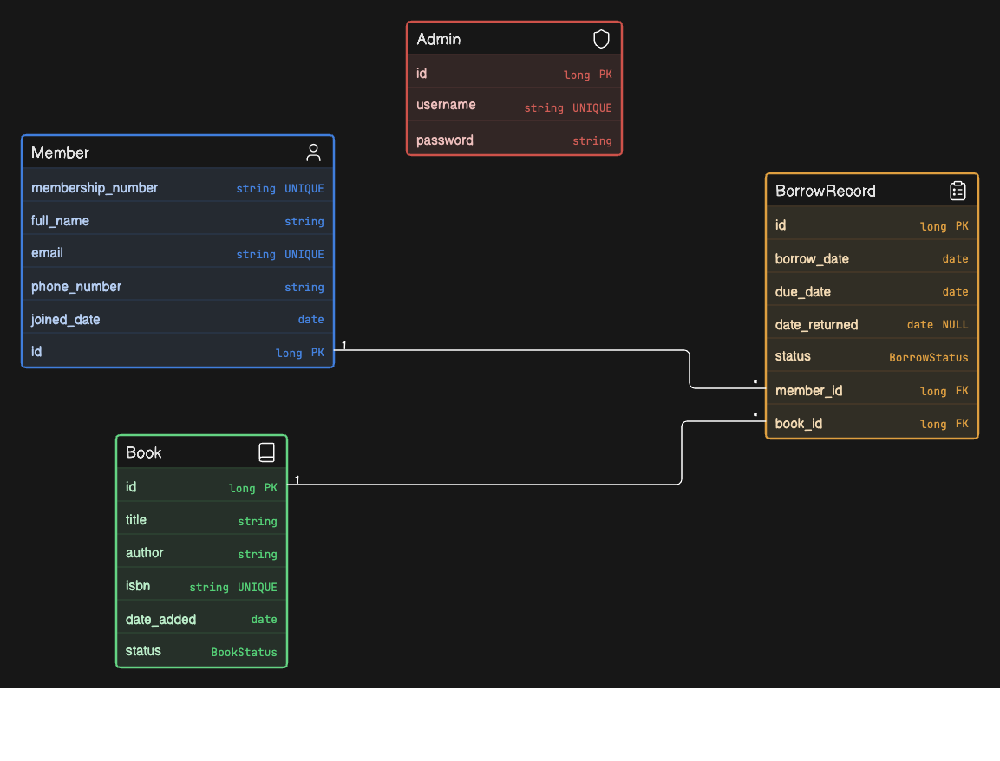
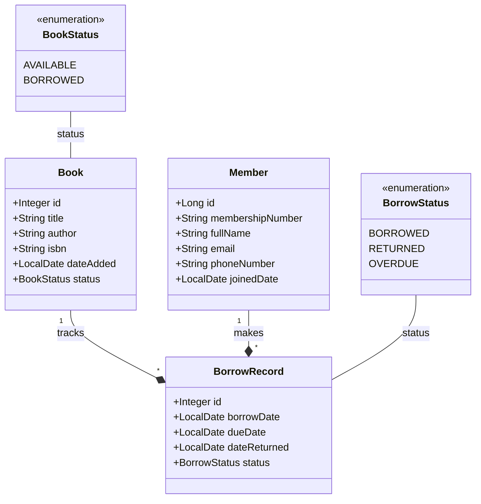

# 📚 Library Management System

A production-ready **Spring Boot** REST API designed for managing book catalogs, library members, and transactional borrowing workflows.

[](https://openjdk.org)
[](https://spring.io/projects/spring-boot)
[](https://www.postgresql.org)

---

## 🗄️ Database Schema & Architecture

The system structures library entities with transactional consistency. The following diagram illustrates these entity relationships:

<p align="center">
  
</p>

### Class Schema Representation (Mermaid)



---

## 📂 Project Directory Structure

```text
src/main/java/org/example/librarymanagementsystem/
├── Entities/
│   ├── Book.java                   # Book catalog entity
│   ├── Member.java                 # Library patron entity
│   └── BorrowRecord.java           # Transactional borrow/return join entity
├── controllers/
│   └── MemberController.java       # Member registration endpoint
├── dto/
│   └── CreateMemberRequestDto.java # Member registration request DTO
├── enums/
│   ├── BookStatus.java             # Book availability states
│   └── BorrowStatus.java           # Borrow record transaction states
├── repository/
│   ├── BookRepository.java         # Database access for Books
│   ├── MemberRepository.java       # Database access for Members (supports custom sequence queries)
│   └── BorrowRecordRepository.java # Database access for Borrow Records
└── services/
    └── MemberService.java          # Handles business logic for members
```

---

## 🔌 API Endpoints Reference

### Members API

#### 📥 Register a Member
- **HTTP Method**: `POST`
- **URL Path**: `/members`
- **Headers**: `Content-Type: application/json`
- **Request Body (JSON)**:
  ```json
  {
    "fullName": "Jane Doe",
    "email": "jane.doe@example.com",
    "phoneNumber": "+1234567890"
  }
  ```
- **Responses**:
  - `201 Created`
    ```text
    Member registered successfully
    ```
  - `400 Bad Request` (If validation fails, e.g. blank name/invalid email format)

---

## 🚀 Setup & Local Execution

### 1. Database Configuration
Ensure PostgreSQL is installed and running on your machine, then create the database and its sequence:

```sql
-- Create library database
CREATE DATABASE librarydb;

-- Connect to librarydb and create the custom sequence for membership numbering
CREATE SEQUENCE membership_number_seq START WITH 1;
```

Update your configuration in [application.properties](src/main/resources/application.properties) or set the `DB_PASSWORD` environment variable.

```properties
spring.datasource.url=jdbc:postgresql://localhost:5432/librarydb
spring.datasource.username=postgres
spring.datasource.password=${DB_PASSWORD}
```

### 2. Set Environment Variables
Export the database password in your terminal:

```bash
export DB_PASSWORD=your_postgres_password
```

### 3. Build & Run
Compile and start the Spring Boot application using the Maven wrapper:

```bash
# Clean and compile project
./mvnw clean compile

# Launch the application
./mvnw spring-boot:run
```

The main entry point class is located at [LibraryManagementSystemApplication.java](src/main/java/org/example/librarymanagementsystem/LibraryManagementSystemApplication.java).