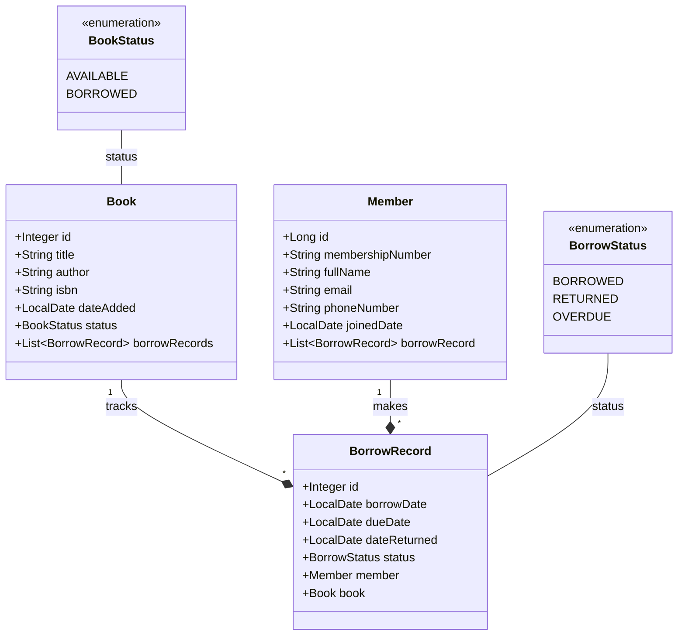

# 📚 Library Management System

A production-ready **Spring Boot** REST API project designed for managing books, members, borrowing transactions, and return workflows with transactional consistency.

[](https://openjdk.org)
[](https://spring.io/projects/spring-boot)
[](https://www.postgresql.org)

---

## 🗄️ Entity Relationship Diagram

Here is the database schema visualization illustrating the relationships among key models:

<p align="center">
  
</p>

### Mermaid Class Diagram Representation



---

## 🏗️ Domain Models & Package Structure

The domain logic is organized into clean, decoupled entities representing the core components of the library system.

### 🔑 Core Entities

1. **[Book](src/main/java/org/example/librarymanagementsystem/Entities/Book.java)**: Represents individual books within the library catalog.
   - Status tracking via `[BookStatus](src/main/java/org/example/librarymanagementsystem/enums/BookStatus.java)` (`AVAILABLE`, `BORROWED`).
   - One-to-many relationship mapping to borrowing history.

2. **[Member](src/main/java/org/example/librarymanagementsystem/Entities/Member.java)**: Library patrons registered to borrow catalog materials.
   - Unique constraints on `membershipNumber` and `email` to maintain identity integrity.
   - Tracks a history of all transaction records.

3. **[BorrowRecord](src/main/java/org/example/librarymanagementsystem/Entities/BorrowRecord.java)**: The transactional join entity that links a `[Member](src/main/java/org/example/librarymanagementsystem/Entities/Member.java)` and a `[Book](src/main/java/org/example/librarymanagementsystem/Entities/Book.java)`.
   - Tracks `borrowDate`, `dueDate`, and `dateReturned`.
   - Status tracking via `[BorrowStatus](src/main/java/org/example/librarymanagementsystem/enums/BorrowStatus.java)` (`BORROWED`, `RETURNED`, `OVERDUE`).

---

## 🛠️ Technology Stack & Dependencies

Defined in [pom.xml](pom.xml):
- **Core Framework**: Spring Boot Starter Web, Spring Security, Validation
- **Persistence Layer**: Spring Data JPA & Hibernate
- **Database Driver**: PostgreSQL
- **Utility / Boilerplate Reduction**: Project Lombok
- **Java Platform**: OpenJDK 21

---

## 🚀 Setup & Local Execution

### 1. Database Configuration

The application expects a local PostgreSQL instance running. Ensure you configure it in [application.properties](src/main/resources/application.properties):

```properties
spring.datasource.url=jdbc:postgresql://localhost:5432/librarydb
spring.datasource.username=postgres
spring.datasource.password=${DB_PASSWORD}
```

Create the database locally before running the application:
```sql
CREATE DATABASE librarydb;
```

### 2. Environment Variables

Set the environment variable `DB_PASSWORD` in your terminal or Run Configuration:

```bash
export DB_PASSWORD=your_postgres_password
```

### 3. Running the Application

Build and run using the Maven wrapper:

```bash
# Clean and compile the codebase
./mvnw clean compile

# Run the Spring Boot application
./mvnw spring-boot:run
```

The main class is located at [LibraryManagementSystemApplication.java](src/main/java/org/example/librarymanagementsystem/LibraryManagementSystemApplication.java).